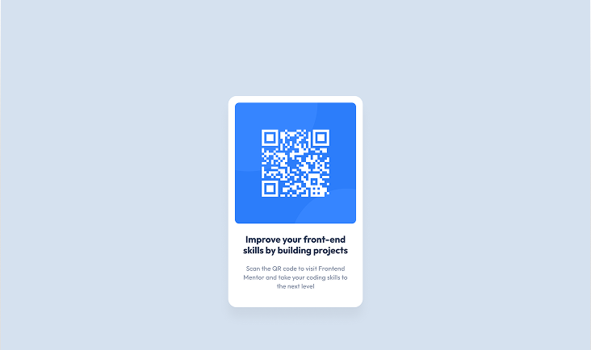

# QR Code Component

Este é um projeto simples desenvolvido como parte de um desafio do [Frontend Mentor](https://www.frontendmentor.io/), com o objetivo de praticar HTML e CSS puros — especialmente o uso de Flexbox — e construir um componente de cartão com QR Code.

---

# 🌐 Acesse o Projeto Publicado

## ➡️ [Clique aqui para visualizar online](https://codebyneander.github.io/code-qr-component-project/)

---

## 🎯 Objetivo

O principal objetivo foi:
- Praticar **HTML e CSS puro**
- Dominar o **Flexbox**
- Concluir o primeiro desafio da plataforma **Frontend Mentor**

## 🛠 Tecnologias Utilizadas

- HTML5
- CSS3 (com Flexbox)

## 📚 Aprendizados

Durante o desenvolvimento, aprendi a:
- Centralizar elementos no centro exato da tela usando Flexbox
- Organizar a estrutura HTML com semântica adequada

## ❗ Dificuldades Encontradas

A maior dificuldade foi centralizar a `div` principal exatamente no meio da página. A solução foi aplicar `height: 100vh` no `body` junto com `display: flex`, `justify-content: center` e `align-items: center`.

## 💼 Fonte do Desafio

Este desafio foi retirado da plataforma **Frontend Mentor**:  
🔗 [QR Code Component Challenge](https://www.frontendmentor.io/challenges/qr-code-component-iux_sIO_H)

## 🚫 Evoluções Futuras

Este projeto não será evoluído, pois foi feito apenas com o objetivo de cumprir o desafio e praticar os fundamentos.

---

## 👤 Autor

- Nome: **Renan Guilherme**
- Frontend Mentor: [@renan-guilherme](https://www.frontendmentor.io/profile/codebyneander)
- Instagram Dev: [@renanguilherme.dev](https://instagram.com/renanguilherme.dev)
- LinkedIn: [Renan Guilherme](https://linkedin.com/in/renan-guilherme)

---

## 🙏 Agradecimentos

Agradeço ao **Frontend Mentor** pela proposta prática, e também à mim mesmo pela consistência nessa fase de evolução como dev.

---

> Projeto desenvolvido como parte do meu processo de crescimento no mundo do desenvolvimento web. Um pequeno passo no código, um salto na jornada. 🚀
